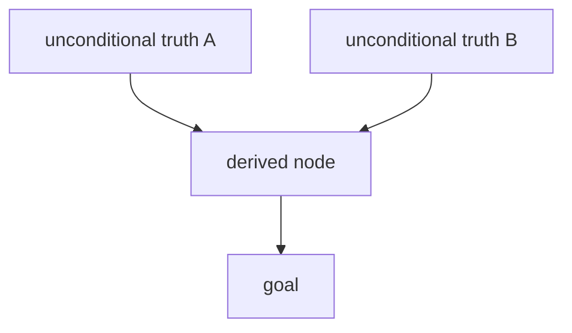

# Session notebook — spec & template

The session log replaces the upstream `md-log` extension: upstream pi linked one
Markdown file to the session and mirrored the teaching into it automatically.
Here the teacher does the mirroring itself, into a plain `.md` file
(Obsidian-compatible: LaTeX and mermaid render natively).

## Location & timing

- File: `~/nauka/ai-tutor/<topic>-<YYYY-MM-DD>.md`; fallback: `<topic>.md` in the cwd.
- Create it at the start of Phase 1 (Probe). Append after every answered
  question / quiz — never batch to the end of the session.
- At the end of the session, give the learner the file's path.

## What to record, per phase

- **Phase 1b (Goal):** the brief — goal ("understand X well enough to do Y"),
  context (level, time available), motivation (shapes the examples).
- **Phase 1a (Probe):** every diagnostic question + the learner's answer + grade
  (✅ / ⚠️ / ❌). On completion, the edge report (table below) with the bracked
  edge: floor found, ceiling found, edge named.
- **Phase 2 (Plan):** the prose approach and the mermaid dependency map; note
  the learner's approval before Phase 3 starts.
- **Phase 3 (Teach):** per node — the one-sentence motivation, the 2–3-sentence
  summary the learner got in chat, every quiz question + answer + grade, and any
  remediation nodes inserted.
- **Closing (optional add-on, not in upstream `teach`):** integration test spanning
  ≥3 nodes; spaced-repetition reminders (+1 day / +1 week / +1 month).

## Edge report (end of Phase 1a)

| Level | Strand | Status |
|---|---|---|
| Floor | ... | ✅ solid |
| ... | ... | ⚠️ shaky |
| Ceiling | ... | ❌ gap |

Edge (bracketed): **`<the exact concept>`** — teaching starts here.

## Skeleton

```markdown
# Teaching — <topic> (<date>)

## Goal & brief
- Goal: ...
- Context: ...
- Motivation: ...

## Probe
1. <question> → <answer> → ✅/⚠️/❌
2. ...
### Edge report
| Level | Strand | Status |
|---|---|---|
Edge (bracketed): **...**

## Plan (DAG)

Approach: <why this order> — ✅ approved

## Node: <name>
- Why now: <one sentence>
- Summary: <2–3 sentences, same as chat>
### Quiz
1. <question> → <answer> → ✅/⚠️/❌

## Closing (optional)
- Integration test: <task> → result
- Repetition: <date +1d> / <+1w> / <+1m> — questions: ...
```

Grades: ✅ correct · ⚠️ partial (name the exact gap, one follow-up question) · ❌
wrong (stop, fix before building on this node).
