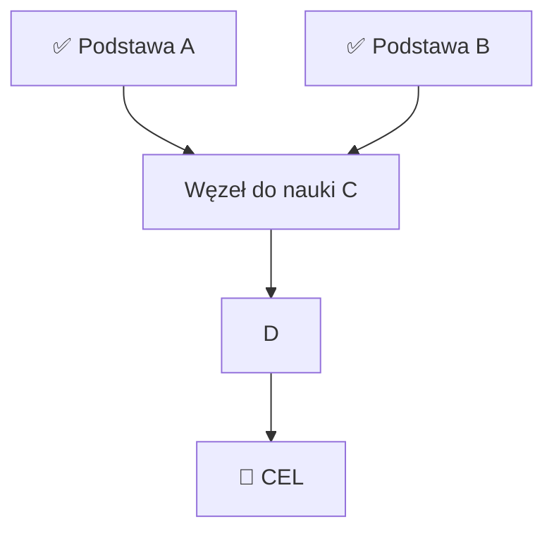

# Szablony i formaty pomocnicze dla skilla ai-tutor

## Format quizu węzła

**QUIZ — węzeł `<nazwa>`** (odblokuje: `<następny węzeł>`)

1. [koncept] Pytanie o intuicję/interpretację — wymaga własnymi słowami.
2. [rachunek] Konkretny przykład do przeliczenia (podaj dane, sprawdź jednostki).
3. [pułapka] Pytanie z dystraktorem, który występuje typowo — testuje czy nie
   wyuczył się "na pamięć bez zrozumienia".

Ocena: ✅ / ⚠️ (częściowo) / ❌ → odpowiednia ścieżka remediacji.

## Format raportu PROBE

| Poziom | Zakres | Status |
|---|---|---|
| Baza | ... | ✅ pewne |
| Środek | ... | ⚠️ niepewne |
| Cel | ... | ❌ brak |

Krawędź wiedzy: **`<konkretne pojęcie>`** — stąd zaczynamy.

## Format planu (Mermaid)



## Poziomy trudności quizu (dopasowanie do sondażu)

- **L0 rozgrzewka:** 1 pytanie odtwórcze — potwierdza podstawę.
- **L1 standard:** zastosowanie w nowym przykładzie.
- **L2 transfer:** przeniesienie pojęcia do innego kontekstu / zadanie
  niestandardowe — tylko gdy ucz jest mocny w węźle.

## Szablon notatnika sesji (plik `.md`)

Plik: `~/nauka/ai-tutor/<temat>-<YYYY-MM-DD>.md` (fallback: cwd). Prowadź
od fazy PROBE, aktualizuj na bieżąco.

```markdown
# AI Tutor — <temat> (<data>)

## Brief
- Cel: ...
- Kontekst: ...
- Motywacja: ...

## PROBE
1. <pytanie> → odpowiedź ucznia → ✅/⚠️/❌
...
### Raport
| Poziom | Zakres | Status |
|---|---|---|
Krawędź wiedzy: **...**

## Plan (DAG)
```mermaid
graph TD ... 
```

## Węzeł: <nazwa>
- PO CO: ...
- Podsumowanie: ...
### Quiz
1. <pytanie> → odpowiedź → ✅/⚠️/❌

## Domknięcie
- Test integracyjny: <zadanie> → wynik
- Powtórki: <data +1d> / <data +1 tydz.> / <data +1 mies.> — pytania: ...
```
